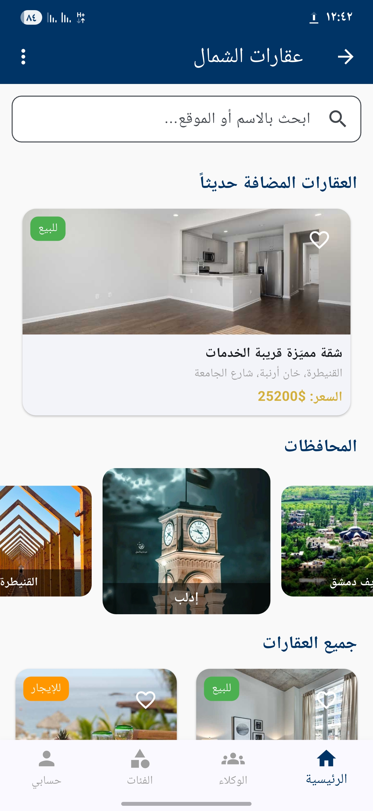

# 🏠 Real Estate Platform

Flutter-based real estate mobile application for browsing, searching, and exploring properties with a modern user experience.

---

## 🚀 Features

- Property browsing and listing interface
- Advanced property search and filtering
- Property details view
- Interactive maps integration
- Modern and responsive Flutter UI
- User-friendly mobile experience
- Media-rich property presentation

---

## 🛠️ Tech Stack

- Flutter
- Dart
- Google Maps Flutter
- HTTP
- Image Picker
- Shared Preferences
- Lottie
- Carousel Slider
- URL Launcher
- WebView Flutter
- YouTube Player

---

## 📸 Screenshots

### Home Screen


### Property Details


### Search & Filters


### Maps Integration


---

## 📖 Project Overview

This project is a real estate mobile application built with Flutter.  
It allows users to explore available properties, search based on different criteria, view detailed property information, and interact with map-based location features.

The application focuses on usability, visual presentation, and a smooth browsing experience for real estate listings.

---

## ▶️ How to Run

1. Clone the repository:
```bash
git clone https://github.com/mohammedkhaledalkhaled-maker/real-estate-platform.git
cd real-estate-platform
